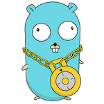

# lock
[](https://goreportcard.com/report/github.com/IamFaizanKhalid/lock) [](https://github.com/IamFaizanKhalid/lock/releases) [](./LICENSE)



A simple Golang package to get notified when the screen gets locked.

⚠️ **Warnings:**
1. This was developed as an experiment and may not always work.
2. It currently supports only macOS, Windows and Linux.
3. Not tested on all linux desktops

## Installation

```console
go get -u github.com/IamFaizanKhalid/lock
```

## Usage Example

```go
package main

import (
	"fmt"
	"time"

	"github.com/IamFaizanKhalid/lock"
)

func main() {
	if lock.IsScreenLocked() {
		fmt.Println("Screen is locked...")
	} else {
		fmt.Println("Screen is not locked...")
	}

	lock.HandleEvents(lockEventHandler)
}

func lockEventHandler(e lock.Event) {
	fmt.Print(e.Time.Format(time.TimeOnly), "\t")
	if e.Locked {
		fmt.Println("screen locked")
	} else {
		fmt.Println("screen unlocked")
	}
}
```


## License

[MIT License](./LICENSE)
